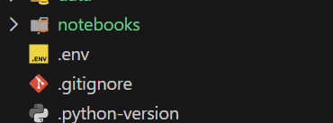

# Raiffeisen's Agentic-AI For Finance Training Workshop
This project is intended to be used for the Agentic AI for Finance Training Week - as part of the [MSCA Digital](https://www.digital-finance-msca.com/event-details-registration/agentic-ai-for-finance-training-week).

## Installation

1. To setup the project, first clone it to your computer:
```
git clone <project path>
```

2. This project is using [uv](https://docs.astral.sh/uv/) as a replacement to the traditional `pip install ...`. It creates an segregated project environment and ensures you have the same package versions.  
[Install uv](https://docs.astral.sh/uv/getting-started/installation/) on your computer - based on your operating system.  
    #### Linux:
    ```bash
    curl -LsSf https://astral.sh/uv/install.sh | sh
    ```
    #### Windows:
    ```powershell
    powershell -ExecutionPolicy ByPass -c "irm https://astral.sh/uv/install.ps1 | iex"
    ```

3. Use UV to setup the python environment and install all the packages, by running this command in ther terminal / Powershell, from **within the project folder**: 
```
uv sync
```

If everything is installed properly, let's continue to setting up the Azure API keys.

## IDE
We're using [Visual Studio Code](https://code.visualstudio.com/), but feel free to use your favorite IDE.

## Azure API
You may find under `api_key.md` the API key we will be using to connect to Azure. Use this [decompiler](https://bitcompiler.com/encrypt-decrypt) tool to decrypt it. You will get the decryption key during the workshop.

Create a new file in the main folder of the project, named `.env`. In this file, you can store secrets, such as the OpenAI API Key, like so:
```
OPENAI_API_KEY=<THE DECRYPTED API KEY>
```

This way, the secrets can be stored also when you re-open the computer tomorrow. We will use a special package, [dotenv](), to load the secrets from this special, hidden file. 

Here is how it should look like in your folder:


## Folder Structure

Under the `notebooks` folder, you will find the exercises notebooks that we will be using during the workshop.

Under `data` are datasets that we will use, as well as images and pdfs for examples.
